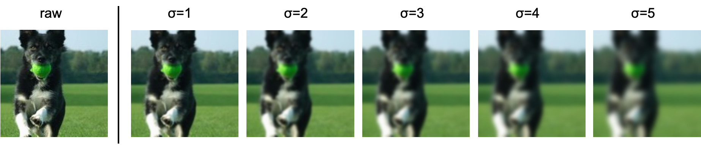

# blur-training_imagenet16
Blur-training with 16-class-ImageNet


## Blurred images (GaussianBlur)
Training images are blurred by Gaussian function. The images are more blurred as std.(σ) of Gaussian kernel is bigger.



## Schedule
You can try different training schedule as for blurring images. Here is an overview of the training schedule:


## CNNs Architecture
**Default: AlexNet (16 class)**  
Since the number of class is 16, I change the number of final units from 1000 to 16.
See more in `notebook/models.ipynb`  
You can also use another architecture by using `--arch [ARCHITECTURE NAME]`. See `python main.py -h` for the available models (from pytorchvision's model zoo).


## Preparation
- Install Python Packages  
```bash
$ pip install -r requirements.txt
```
Or pull and run [docker image][docker-blur-training] (e.g. blur-training:latest) which I made for these experiments.
You may need to install **robustness** library in the container like:
```bash
$ pip install robustness==1.1
``` 
- Get ImageNet images & set the path. If you already have ImageNet, set `in_path` variable in `training/utils.py`.  
If not, Download the ImageNet dataset from http://www.image-net.org/  
    (Note that the ImageNet images need to be divided in two subdirectories, ``train/`` and ``val/``.)  
    Then set the path.
    
    
## run examples
General usage example:
```bash
$ cd training
$ python main.py --arch [ARCHITECTURE NAME] --mode [TRAINING MODE] -n [EXPERIMENT NAME] 
```  

For `main.py`, you need to use `--exp-name` or `-n` option to define your experiment's name.
Then the experiment's name is used for managing results under `logs/` directory.
`logs/` directory will automatically be created when you run `main.py`.   
You can choose the training mode from:   
`normal, all, mix, reversed-single-step, single-step, multi-steps`  
by using `--mode [TRAINING MODE]` option.

- **normal**  
This mode trains Normal model (default: AlexNet).  
usage example:  
```bash
$ python main.py --mode normal -e 60 -b 64 --lr 0.01 -n normal
```

- **all**  
This mode blurs ALL images in the training mode.  
usage example:  
```bash
$ python main.py --mode all -s1 -n all_s1
```

- **mix**    
This mode blurs half training data.
usage example:  
```bash
$ python main.py --mode mix -s 1 -n mix_s1
```

- **random-mix** <br>
This mode blurs half training data **randomly**. <br>
usage example:
```bash
$ python main.py --arch alexnet --mode random-mix --min_sigma 0 --max_sigma 5 -n alexnet_random-mix_s0-5
```

- **single-step**    
This mode blurs first half epochs (e.g. first 30 epochs in 60 entire epochs) in the training.
usage example:  
```bash
$ python main.py --mode single-step -s 1 -n single-step_s1
```

- **multi-steps**  
This mode blurs images step by step (e.g. every 10 epochs).  
usage example:  
```bash
$ python main.py --mode multi-steps -n multi-steps
```

- `--resume [PATH TO SAVED MODEL]`   
This option trains your saved model starting from the latest epoch.  
usage example:  
```bash
$ python main.py --mode mix -a alexnet -s 1 -e 90 -b 64 --resume ../logs/models/mix_s1/model_060.pth.tar -n mix_s1_from60e 
```


## notebook
Demonstrations of 16-class-ImageNet, GaussianBlur, and CNN model architectures.


## citation
Training scripts and functions are based rely on [pytorch tutorial][pytorch-tutorial] and [pytorch imagenet trainning example][pytorch-imagenet].


[pytorch-imagenet]:https://github.com/pytorch/examples/blob/master/imagenet
[docker-blur-training]:https://hub.docker.com/r/sousquared/blur-training
